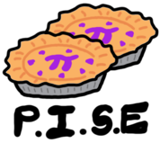

# Proofscape ISE

This is the source code for
[PISE, the Proofscape Integrated Study Environment](https://docs.proofscape.org/pise/index.html).

If you are interested in contributing to the project, please read
[CONTRIBUTING.md](CONTRIBUTING.md), and then see
[manage/README.md](./manage/README.md) for help getting started.
